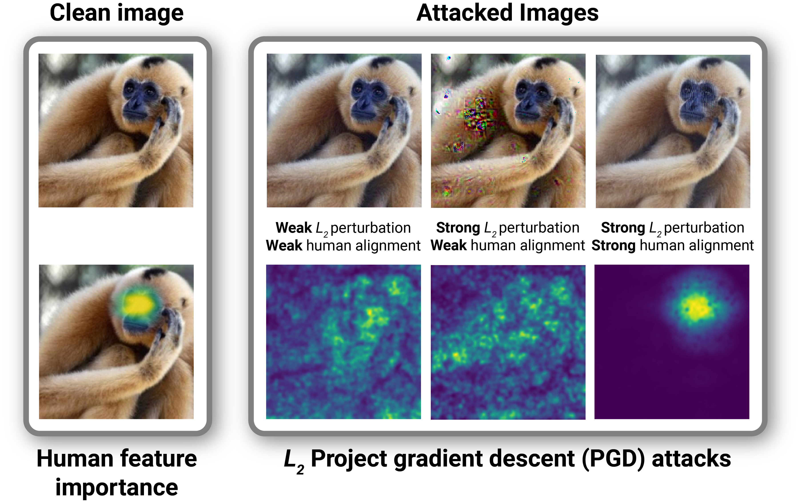

# Adversarial Alignment: breaking the trade-off between the strength of an attack and its relevance to human perception

<div>
    <a href="#">
        
    </a>
    <a href="https://github.com/serre-lab/Harmonization/actions/workflows/python-lint.yml">
        
    </a>
    <a href="https://github.com/serre-lab/Harmonization/actions/workflows/python-tests.yml">
        
    </a>
    <a href="https://github.com/serre-lab/Harmonization/actions/workflows/python-pip.yml">
        
    </a>
    <a href="https://pepy.tech/project/harmonization">
        
    </a>
    <a href="#">
        
    </a>
</div>

<br>

_Drew Linsley*, Pinyuan Feng*, Thibaut Boissin, Alekh Karkada Ashok, Thomas Fel, Stephanie Olaiya, Thomas Serre_

<p align="center">
  <a href=""><strong>Read our paper »</strong></a>
  <br>
  <br>
  <a href="https://serre-lab.github.io/Adversarial-Alignment/">Website</a>
  ·
  <a href="https://serre-lab.github.io/Adversarial-Alignment/results">Results</a>
  ·
  <a href="https://serre-lab.github.io/Adversarial-Alignment/models/">Model Info</a>
  ·
  <a href="https://arxiv.org/abs/2211.04533">Harmonization</a>
  ·
  <a href="https://arxiv.org/abs/1805.08819">ClickMe</a>
</p>

<p align="center">

</p>
<p><p><p>

## Abstract
Deep neural networks (DNNs) are known to have a fundamental sensitivity to adversarial attacks, perturbations of the input that are imperceptible to humans yet powerful enough to change the visual decision of a model. Adversarial attacks have long been considered the “Achilles' heel” of deep learning, which may eventually force a shift in modeling paradigms. Nevertheless, the formidable capabilities of modern large-scale DNNs have somewhat eclipsed these early concerns. Do adversarial attacks continue to pose a threat to DNNs?

In this study, we investigate how the robustness of DNNs to adversarial attacks has evolved as their accuracy on ImageNet has continued to improve. We measure adversarial robustness in two different ways: First, we measure the smallest adversarial attack needed to cause a model to change its object categorization decision. Second, we measure how aligned successful attacks are with the features that humans find diagnostic for object recognition. We find that adversarial attacks are inducing bigger and more easily detectable changes to image pixels as DNNs grow better on ImageNet, but these attacks are also becoming less aligned with the features that humans find diagnostic for object recognition. To better understand the source of this trade-off and if it is a byproduct of DNN architectures or the routines used to train them, we turned to the *neural harmonizer*, a DNN training routine that aligns their perceptual strategies with humans. Harmonized DNNs achieve the best of both worlds and experience attacks that are both detectable and affect object features that humans find diagnostic for recognition, meaning that attacks on these models are more likely to be rendered ineffective by inducing similar effects on human perception. Our findings suggest that the sensitivity of DNNs to adversarial attacks could potentially be addressed by continued increases in model and data scale and novel training routines that promote alignment with biological intelligence.

## Dataset
We did our experiments on [ClickMe dataset](https://connectomics.clps.brown.edu/tf_records/), a large-scale effort for capturing feature importance maps from human participants that highlight parts that are relevant and irrelevant for recognition. We created a subset of ClickMe, one image per category, in our experiment. If you want to replicate our experiment, please put the TF-Record file in `./datasets`.

## Environment Setup

```
conda create -n adv python=3.8 -y
conda activate adv
conda install pytorch==1.13.1 torchvision==0.14.1 pytorch-cuda=11.7 -c pytorch -c nvidia
pip install tensorflow==2.12.0
pip install timm==0.8.10.dev0
pip install harmonization
pip install numpy matplotlib scipy tqdm pandas
```

## Implementations
- You can enter the following command in Terminal
```
python main.py --model "resnet" --cuda 0 --spearman 1
```
- Google Colab notebook
    - You can run 2 .ipynb files if you have installation issues. Please check the folder `./scripts`


## Images 
- There are 10 example images in `./images`. 
- The images contains ImageNet images, human feature importance maps from ClickMe, and adversarial attacks for a variety of DNNs.

## Models
- In our experiment, 283 models have been tested
    - 125 PyTorch CNN models from [timm library](https://timm.fast.ai/)
    - 121 PyTorch ViT models from [timm library](https://timm.fast.ai/)
    - 15 PyTorch ViT/CNN hybrid architectures from [timm library](https://timm.fast.ai/)
    - 14 Tensorflow Harmonized models from [harmonizatin library](https://serre-lab.github.io/Harmonization/)
    - 4 Baseline models
    - 4 models that were trained for robustness to adversarial example
- The Top-1 ImageNet accuracy for each model refers to [Hugging Face results](https://github.com/huggingface/pytorch-image-models/blob/main/results/results-imagenet.csv)

## **Citation**

If you use or build on our work as part of your workflow in a scientific publication, please consider citing the [official paper]():

```
@article{linsley2023adv,
  title={Adversarial Alignment: breaking the trade-off between the strength of an attack and its relevance to human perception},
  author={Linsley, Drew and Feng, Pinyuan and Boissin, Thibaut and Ashok, Alekh Karkada and Fel, Thomas and Olaiya Stephanie and Serre, Thomas},
  year={2023}
}
```

If you have any questions about the paper, please contact Drew at [drew_linsley@brown.edu](drew_linsley@brown.edu).

## **Acknowledgement**

This paper relies heavily on previous work from Serre Lab, notably [Harmonization](https://serre-lab.github.io/Harmonization/) and [ClickMe](https://serre-lab.clps.brown.edu/resource/clickme/).

```
@article{fel2022aligning,
  title={Harmonizing the object recognition strategies of deep neural networks with humans},
  author={Fel, Thomas and Felipe, Ivan and Linsley, Drew and Serre, Thomas},
  journal={Advances in Neural Information Processing Systems (NeurIPS)},
  year={2022}
}

@article{linsley2018learning,
  title={Learning what and where to attend},
  author={Linsley, Drew and Shiebler, Dan and Eberhardt, Sven and Serre, Thomas},
  journal={International Conference on Learning Representations (ICLR)},
  year={2019}
}
```

## License
The package is released under [MIT license](https://choosealicense.com/licenses/mit/)

