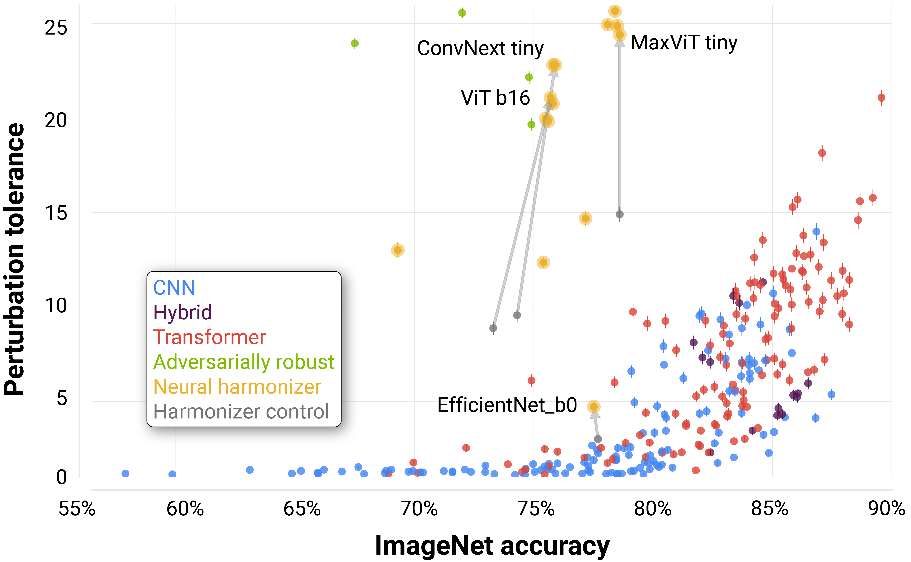
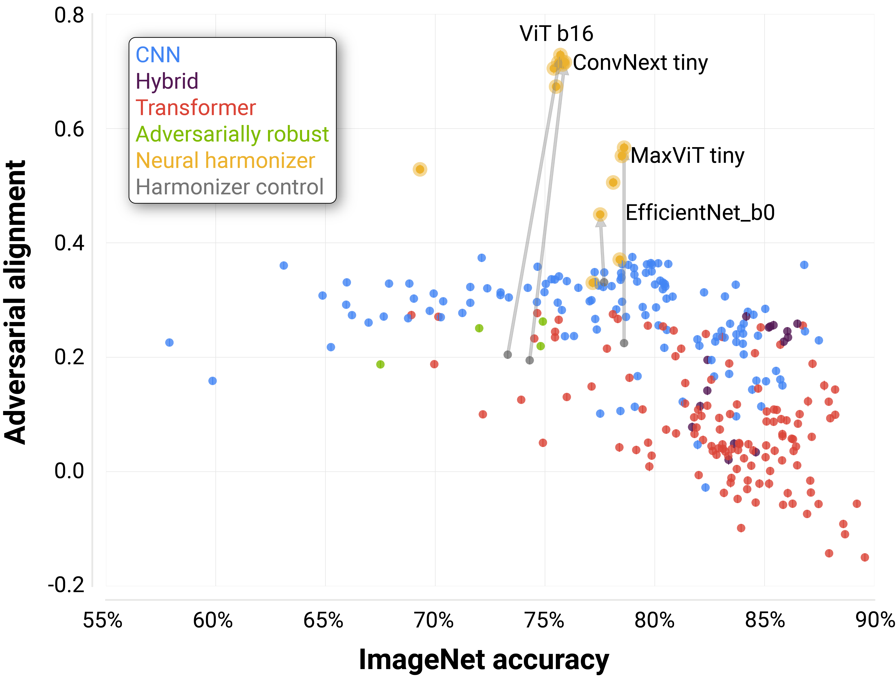

# Results

## **Perturbation Torlerance**

    

<!-- 

    

 -->

**The perturbation tolerance of DNNs has significantly increased as they have improved on ImageNet.** Each dot denotes a DNN's ImageNet accuracy vs. its average $\ell_2$ robustness radius to $\ell_2$ PGD attacks, which we call ''perturbation tolerance''. Arrows show the change of a DNN in both dimensions after it has been trained with the neural harmonizer. There is a significant positive correlation between ImageNet accuracy and perturbation tolerance ($\rho_{s} = 0.70$, $p < 0.001$). Error bars denote standard error, and variance may be so small for some models that they are not visible.

## **Adversarial Alignment**

    

<!-- 

 -->

**Successful adversarial attacks on DNNs are becoming less aligned with human perception as they have improved on ImageNet.** Each dot denotes a DNN's ImageNet accuracy vs. the average Spearman correlation between successful attacks an images' human feature importance maps from *ClickMe*. We call this correlation a DNN's adversarial alignment. Arrows show the change of a DNN in both dimensions after it has been trained with the neural harmonizer. Error bars denote standard error, and variance may be so small for some models that they are not visible.

## **Qualitative Results**

<!-- 

 -->

**$\ell_2$ PGD adversarial attacks for DNNs.** Plotted here are ImageNet images, human feature importance maps from ClickMe, and adversarial attacks for a variety of DNNs. Attacked images are included for the image of a monkey at the top (zoom in to see attack details). The red box shows inanimate categories, and the blue box shows animate categories.

